# 应用信息

## 关于TORRID

### **一、开源**

`[zx1360/Torrid]` [https://github.com/zx1360/Torrid

### 二、数据安全

#### 隐私

**所有用户数据存于本地而不会被外部获取**

#### 备份

可通过与我另外一个库中开源软件`monarch`联动, 实现备份到pc上.

格式为json, 适合阅读/修改.

### 三、应用干净

卸载应用即删除所有数据不留痕. 不保留任何配置信息和数据.

**==因此, 未备份的数据会在应用卸载后真正消失.==**

- 打卡/随笔等数据保存于内部应用私有目录
- 相应的图片等文件保存于外部应用私有目录

PS: 除了某些页面手动点击"保存"按钮后, 保存在外部公共空间. (为了保存的图片能够被手机自带的相册识别到).

### 四、后台友好

**CPU友好:** 只有用户操作才会进行响应的操作.

处于后台时不会运行其他行为. (指仍旧活跃的后台代码)

**内存友好: **

不知道, 感觉应该不占内存.

## 注意事项

真正把想法做出成品来才感受得到, 要做到"人性化"真的是费时又费力. 但这一点又恰是最影响使用体验的. 请避免以下行为防止应用出错.

(我没测试过会发生什么情况).

- 不要随意删改应用下的所有文件名/目录名. (不过手机一般操作不到应用目录).
- 不要进行奇怪的操作查看有无奇怪的反应.
- ...

## 另外说明

本应用是出于自用+练手目的制作的, 目标场景以我的需求出发. 比如我喜欢做任务一样地每天做点事然后回顾的时候有成就感, 于是有了**积微页**来打卡. 喜欢每天记点东西就有了**随笔页**写东西.

25年八月中旬了解到flutter开始到目前26年二月中旬, 一旦入门感觉写起来还挺有意思的, 甚至当初开发**随笔页**时十多天小半个月还没弄出来虽然挫败但是最终做出也挺有乐趣的. 另外也略微了解到了应用开发相关知识感觉受益匪浅. 不过到目前**库存页**开发完毕之后应该就搁置仅作维护以及偶尔优化了. 原因有二:

- 一是确实我所期望的**==满足我个性需求的好用的小工具应用==**差不多完善了.
- 二是最近一个月来用教育福利获得的github copilot额度开发, 效果极好, 甚至已经到了额度用完就没啥自己手写的想法的程度了. **<del>不得不说, claude opus真王朝了吧</del>**

部分功能**(如库存页, 漫画页, 藏品页以及本地数据的备份和同步)**需要搭配我的另一个项目**monarch**使用, 他是一个运行在电脑上的Go程序, 用以处理本应用的http请求.

# 页面介绍

## 主页

**可自定义主页背景, 默认简约渐变背景**

    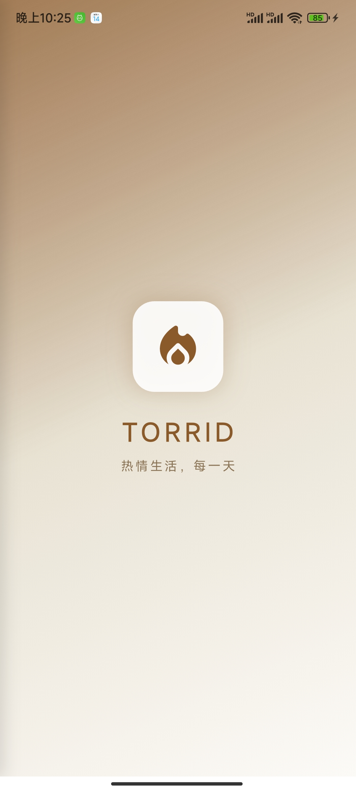
  	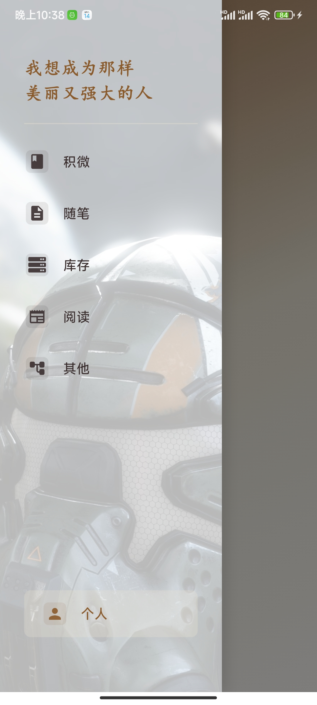

## 积微页

**设置若干任务然后坚持每天完成!**

    
  	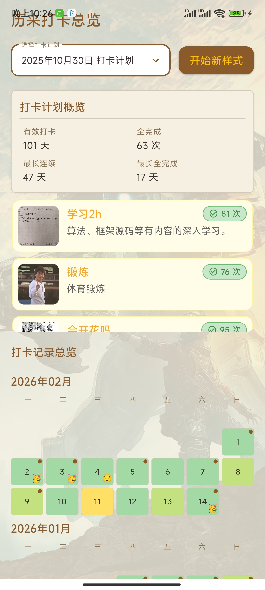
  	

## 随笔页

**写日记、记录回忆、一天的经历等, 并打上标签, 可追加留言.**

    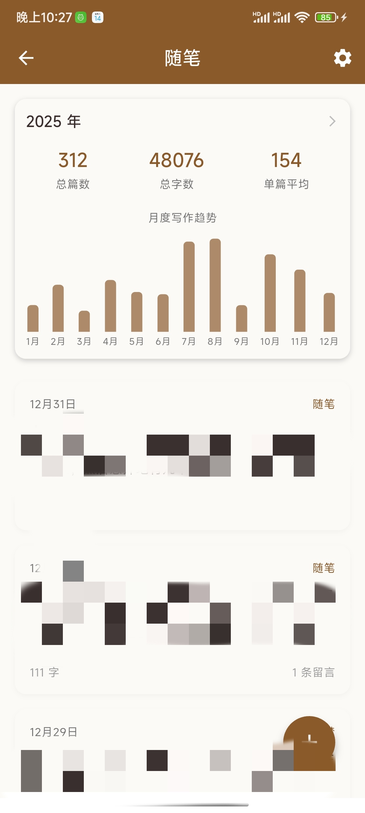
  	

    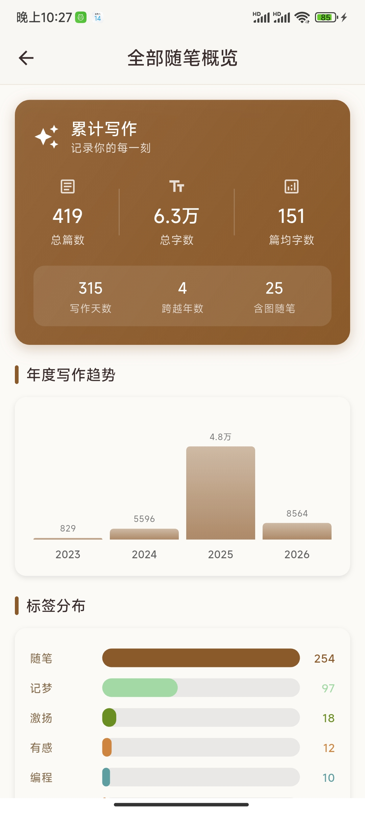
  	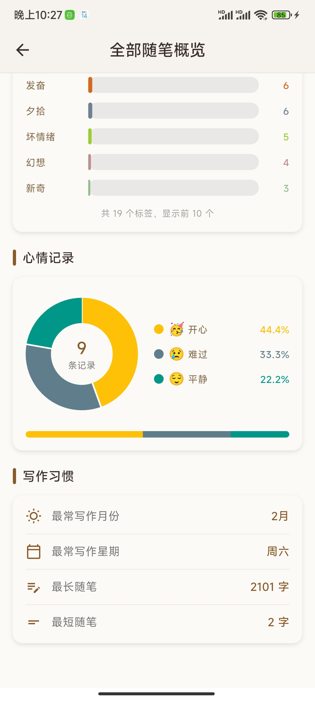

## 库存页

**待完成,  (借助自建服务器)**

## 阅读页

**借助公共在线api, 提供即时信息如每日精炼新闻, epic免费游戏, 各app的热搜.**

    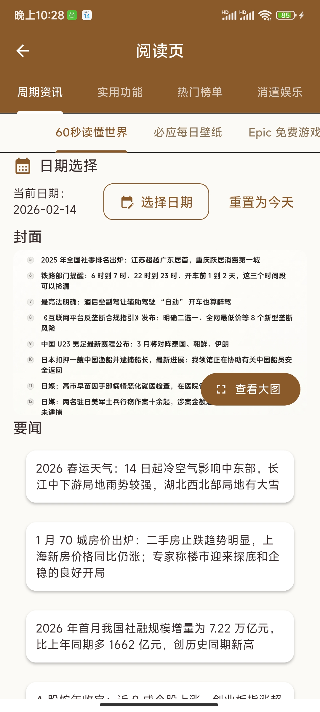
  	
  	

## 其他页

### 漫画页

**本地或在线阅读漫画 (借助自建服务器)**

    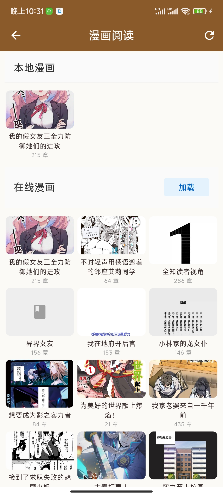
  	

### 藏品页

**回顾以往自己的媒体文件, 标记删除以及打标签等  (借助自建服务器)**

    
  	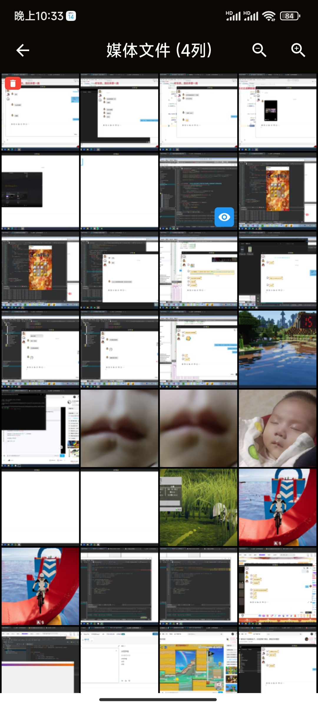

## 用户页

### 偏好设置

**设置主页和侧边菜单的背景, 以及设置侧边菜单的顶部格言部分.**

    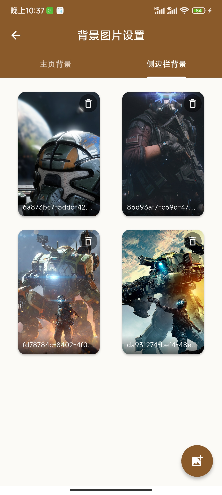
  	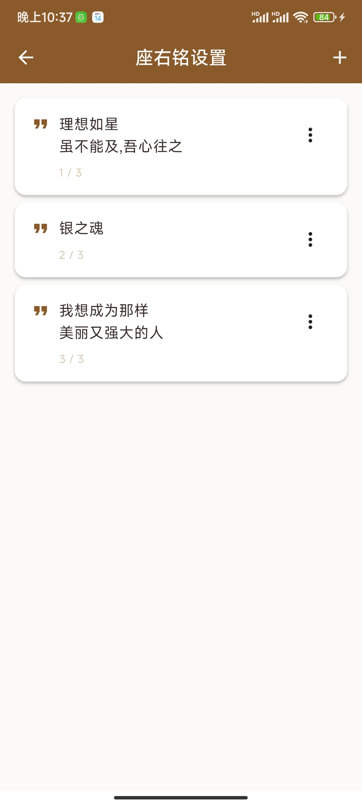

### 数据备份  (借助自建服务器)

**设定服务端的地址端口, 备份/同步数据.**

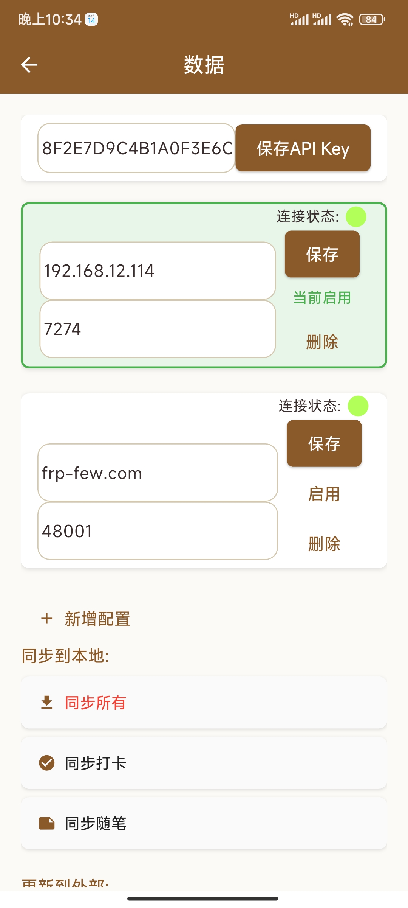

# 反馈问题

<del>不一定会看, 也不一定会改, 因为我这么长时间用下来没问题挺顺手的 :D</del>

- `github` [https://github.com/zx1360/Torrid/issues](https://github.com/zx1360/Torrid/issues)

- `3039328600@qq.com`

